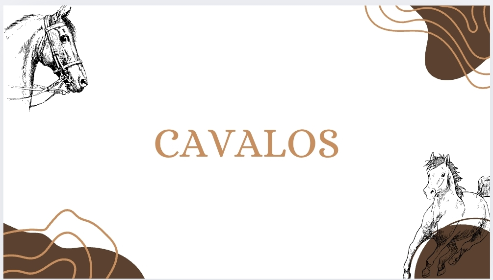

<!DOCTYPE html> 
<html lang= "pt - br" >
  <head>
    <meta charset= "UTF-8"
    <title> site de cavalos</title>
    <link rel= "stylesheet" href= "style.css"
  </head>
  <body>
    <header> 
      <h1 class = "titulo-principal"> Cavalos </h1> 
    </header>
     site informativo sobre cavalos</h1> 
    <h1> site informativo sobre cavalos</h1>
    

    
<strong> cavalos </strongp> site informativo de cabalos, feito em 2025, pelos os alunos do colégio cívico militar helio antonio de souza 

    

    
 
      <h3 class= "titulo-centralizado"> cavalos</h2>
      <h2>Cavalos</h2>
      <ul>
        <li class= "itens" >caraterísticas </li>
        <li class= "itens" > curiosidade </li>
        <li class= "itens" > raças raras</li>
    

  </body>
</html>
